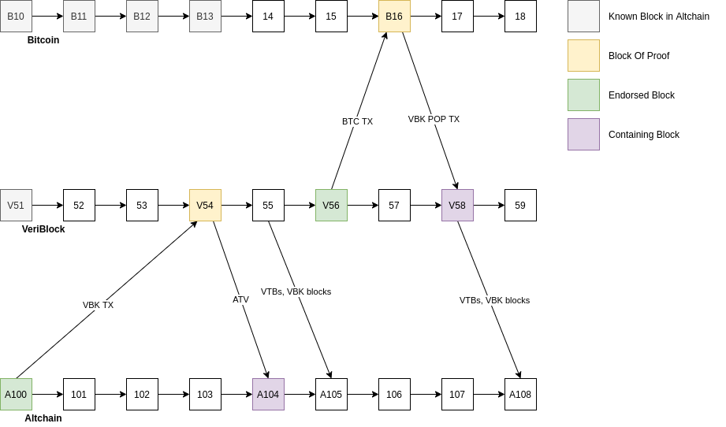

# PoP Description {#description}

[TOC]

# Terms

- Altchain (ALT) - abstract blockchain that inherits security of Bitcoin.
- VeriBlock (VBK) - VeriBlock blockchain https://www.veriblock.org/.
- altintegration::ATV - Cryptographic proof of Altchain block header publication in VeriBlock.
- altintegration::VTB - Cryptographic proof of VeriBlock block header publication in Bitcoin.
- altintegration::VbkBlock - VeriBlock block header.
- Payloads - ATV, VTB, VbkBlock sometimes can be referred to as "payloads".
- altintegration::PopData - contains a list of VTBs, a list of ATVs, and a list of VBK blocks, called "Context".
- APM - Altchain PoP Miner.
- VPM - VeriBlock PoP Miner.
- Security Providing Chain (SP Chain) - blockchain, which stores endorsements and is used for providing security for SI chain.
- Security Inheriting Chain (SI Chain) - blockchain, which consumes endorsements and utilizes properties of SP chain to improve its security.
- Block Of Proof - block in SP chain, which stores endorsement of block from SI chain.
- Endorsed Block - block in SI chain, for which we want to improve PoP score. More endorsements of a block - higher PoP score of this block.
- Containing Block - block in SI chain, which stores proof of endorsement.
- altintegration::VbkTx (VBK TX) - VeriBlock transaction.
- altintegration::BtcTx (BTC TX) - Bitcoin transaction.
- altintegration::VbkPopTx (VBK POP TX) - VeriBlock PoP transaction.
- PoP Payout Delay - altintegration::PoPPayoutsParams::getPoPPayoutDelay() - PoP payout will occur after this amount of blocks after endorsed block.
- Endorsement Settlement Interval - altintegration::AltChainParams::getEndorsementSettlementInterval() - validity window for ATV.
- altintegration::MemPool (PoP MemPool) - memory pool for PoP-related payloads. Represents the content of the "next" block after current tip.
- SPV - simplified payment verification.
- Finalized/Finalization - this term can be applied to a block or transaction. A block is finalized if it can not be reorganized with very high probability (99.99%). For Bitcoin, finality is equal to 11 blocks. For VeriBlock, finality is 2000 blocks.

# Overview

PoP security is built around "endorsing" blocks.
When miners want to increase likelyhood of finalizing a block, they "endorse" it and blocks after it by creating "endorsing transaction" in SP chain.

In example above, we see 3 chains (top-down): Bitcoin, VeriBlock, Altchain.

In Altchain, we want to finalize block A100, then:
1. APM creates altintegration::VbkTx, which contains altintegration::PublicationData - an entity, which contains Endorsed Block header, and Payout Information - for rewarding APM for this endorsement.
2. This VBK TX is sent to VeriBlock.
3. VBK POW miners create block V54 - this block will include this VBK TX from step above.
4. APM builds cryptographic proof that endorsement of Altchain block is added to main chain. This proof is named ATV (Altchain to VeriBlock publication) and includes: VBK TX, Context (VBK blocks connecting V54 to V51 - V52..V53), Block Of Proof (V54), Merkle Path which proves that VBK TX is really inside V54.
5. Then all this data is sent to Altchain, and added to PoP MemPool.
6. When next altintegration::AltBlock is created by POW miner, this ATV is included into block A104.
7. If `PoP Payout Delay` is 50, then payout for this endorsement will occur in block A150.

@note ATV is contextually valid within `Endorsement Settlement Interval`, so if A100 is endorsed, and Settlement Interval is 50, then ATV can be added in any new block in range [A101..A150]. If ATV is not added to main chain within this range, it will expire and will be removed from PoP MemPool.

Continuing this example, VPM does exactly the same algorithm but with VBK blocks.

@note Endorsement Settlement Interval for VeriBlock is 400 blocks, PoP Payout Delay is also 400 blocks.

Block V54 contains proof for A100, and B16 contains proof for block V56.
Since V56 is after V54, and V56 is finalized, we finalize all previous blocks, including V54, thus
Altchain transitively inherits security of Bitcoin.

@note We count endorsements, whose according blocks of proof **are on main chains** of according blockchains. An endorsement whose block of proof is not on the main chain of SP chain is not eligible for PoP Payout.

You can also notice that VTBs and VBK blocks are sent to Altchain.
This is needed to communicate Bitcoin and VeriBlock consensus information to Altchain.
APM implementation continuously submits VBK blocks and VTBs found on VeriBlock network to Altchain, so it is important to have at least 1 APM running continuously for the whole network.
