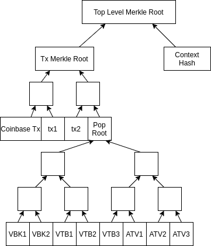

# Pop Merkle trees {#integration_8_merkle}

[TOC]

# Overview

Altchain developers must ensure PopData is cryptographically authenticated in Block Header.

Regular transactions are typically cryptographically authenticated by inserting Merkle Root into Block Header, we will call it Original Merkle Root.

Merkle Root which is inserted into Block Header is now called **Top Level Merkle Root**.



**Algorithm to calculate Top Level Merkle Root**:
1. Build Merkle Tree from individual items of PopData (those are VBK blocks, marked as VBK1 on the picture, VTBs and ATVs), resulting Merkle Root is called **Pop Root**.
2. Insert PopRoot into vector of leaves and calculate **Tx Merkle Root**
3. Calculate `ContextHash = HASH(BlockHeightBE || PreviousKeystoneHash || SecondPreviousKeystoneHash)`

   where
   - `BlockHeightBE` is 4 bytes of block height, serialized in Big-Endian
   - `PreviousKeystoneHash` is a hash of a Previous Keystone Block. Its height can be calculated with altintegration::getPreviousKeystone(int, int)
4. Calculate `TopLevelMerkleRoot = HASH(TxMerkleRoot || ContextHash)`

# 1. VeriBlock Merkle root related functions are implemented in the merkle.hpp and merkle.cpp.

Pop Merkle trees header: [https://github.com/VeriBlock/vbk-ri-btc/blob/master/src/vbk/merkle.hpp](https://github.com/VeriBlock/vbk-ri-btc/blob/master/src/vbk/merkle.hpp). Copy this file to your project.

Pop Merkle trees source: [https://github.com/VeriBlock/vbk-ri-btc/blob/master/src/vbk/merkle.cpp](https://github.com/VeriBlock/vbk-ri-btc/blob/master/src/vbk/merkle.cpp). Copy this file to your project.

@note Merkle Root calculation should fall back to the original Merkle Root if Pop protocol is not activated.

# 2. Use extended block weight calculation method that appends Pop data size.

[https://github.com/VeriBlock/vbk-ri-btc/blob/master/src/consensus/validation.h](https://github.com/VeriBlock/vbk-ri-btc/blob/master/src/consensus/validation.h)
```cpp
 #include <primitives/block.h>

+#include <vbk/util.hpp>
+#include <veriblock/pop.hpp>
```
```cpp
 static inline int64_t GetBlockWeight(const CBlock& block)
 {
-    return ::GetSerializeSize(block, PROTOCOL_VERSION | SERIALIZE_TRANSACTION_NO_WITNESS) * (WITNESS_SCALE_FACTOR - 1) + ::GetSerializeSize(block, PROTOCOL_VERSION);
+    int64_t popDataSize = 0;
+    popDataSize += VeriBlock::GetPopDataWeight(block.popData);
+
+    return ::GetSerializeSize(block, PROTOCOL_VERSION | SERIALIZE_TRANSACTION_NO_WITNESS) * (WITNESS_SCALE_FACTOR - 1) + ::GetSerializeSize(block, PROTOCOL_VERSION) - popDataSize;
 }
```

# 3. Extend ValidationState class for better veriblock-pop-cpp error processing.

[https://github.com/VeriBlock/vbk-ri-btc/blob/master/src/consensus/validation.h](https://github.com/VeriBlock/vbk-ri-btc/blob/master/src/consensus/validation.h)

[class ValidationState](https://github.com/VeriBlock/vbk-ri-btc/blob/master/src/consensus/validation.h#L83)
```cpp
     std::string GetDebugMessage() const { return m_debug_message; }
+    std::string ToString() const {return m_reject_reason + ": " + m_debug_message; }
+
+    operator altintegration::ValidationState() {
+        altintegration::ValidationState v;
+        if(IsInvalid()) {
+            v.Invalid(m_reject_reason, m_debug_message);
+            return v;
+        }
+
+        if(IsError()) {
+            v.Invalid(m_reject_reason);
+            return v;
+        }
+
+        return v;
+    }
```

# 4. Update the mining process with Pop Merkle root calculation.

[https://github.com/VeriBlock/vbk-ri-btc/blob/master/src/miner.cpp](https://github.com/VeriBlock/vbk-ri-btc/blob/master/src/miner.cpp)
```cpp
+#include <vbk/merkle.hpp>
 #include <vbk/pop_service.hpp>
```
[method IncrementExtraNonce](https://github.com/VeriBlock/vbk-ri-btc/blob/master/src/miner.cpp#L446)
```cpp
     pblock->vtx[0] = MakeTransactionRef(std::move(txCoinbase));
-    pblock->hashMerkleRoot = BlockMerkleRoot(*pblock);
+
+    pblock->hashMerkleRoot = VeriBlock::TopLevelMerkleRoot(pindexPrev, *pblock);
```

[https://github.com/VeriBlock/vbk-ri-btc/blob/master/src/test/util/mining.cpp](https://github.com/VeriBlock/vbk-ri-btc/blob/master/src/test/util/mining.cpp)

[method PrepareBlock](https://github.com/VeriBlock/vbk-ri-btc/blob/master/src/test/util/mining.cpp#L41)
```cpp
     block->nTime = ::ChainActive().Tip()->GetMedianTimePast() + 1;
-    block->hashMerkleRoot = BlockMerkleRoot(*block);
+
+    CBlockIndex* tip = ::ChainActive().Tip();
+    assert(tip != nullptr);
+    block->hashMerkleRoot = VeriBlock::TopLevelMerkleRoot(tip, *block);
```

# 5. Since Pop Merkle root algorithm depends on the blockchain, we should move Merkle root validation from the CheckBlock() to the ContextualCheckBlock().

[https://github.com/VeriBlock/vbk-ri-btc/blob/master/src/validation.h](https://github.com/VeriBlock/vbk-ri-btc/blob/master/src/validation.h)
```cpp
 /** Context-independent validity checks */
-bool CheckBlock(const CBlock& block, BlockValidationState& state, const Consensus::Params& consensusParams, bool fCheckPOW = true, bool fCheckMerkleRoot = true);
+bool CheckBlock(const CBlock& block, BlockValidationState& state, const Consensus::Params& consensusParams, bool fCheckPOW = true);
+
+/** Context-dependent validity checks */
+bool ContextualCheckBlock(const CBlock& block, BlockValidationState& state, const Consensus::Params& consensusParams, const CBlockIndex* pindexPrev, bool fCheckMerkleRoot = true);
```

[https://github.com/VeriBlock/vbk-ri-btc/blob/master/src/validation.cpp](https://github.com/VeriBlock/vbk-ri-btc/blob/master/src/validation.cpp)

[method CChainState::ConnectBlock](https://github.com/VeriBlock/vbk-ri-btc/blob/master/src/validation.cpp#L1879)
```cpp
     // is enforced in ContextualCheckBlockHeader(); we wouldn't want to
     // re-enforce that rule here (at least until we make it impossible for
     // GetAdjustedTime() to go backward).
-    if (!CheckBlock(block, state, chainparams.GetConsensus(), !fJustCheck, !fJustCheck)) {
+
+    //VeriBlock : added ContextualCheckBlock() here becuse merkleRoot calculation  moved from the CheckBlock() to the ContextualCheckBlock()
+
+    if (!CheckBlock(block, state, chainparams.GetConsensus(), !fJustCheck) && !ContextualCheckBlock(block, state, chainparams.GetConsensus(), pindex->pprev, true)) {
```
```cpp
-bool CheckBlock(const CBlock& block, BlockValidationState& state, const Consensus::Params& consensusParams, bool fCheckPOW, bool fCheckMerkleRoot)
+bool CheckBlock(const CBlock& block, BlockValidationState& state, const Consensus::Params& consensusParams, bool fCheckPOW)
```
[method CheckBlock](https://github.com/VeriBlock/vbk-ri-btc/blob/master/src/validation.cpp#L3376)
```cpp
     if (!CheckBlockHeader(block, state, consensusParams, fCheckPOW))
         return false;

-    // Check the merkle root.
-    if (fCheckMerkleRoot) {
-        bool mutated;
-        uint256 hashMerkleRoot2 = BlockMerkleRoot(block, &mutated);
-        if (block.hashMerkleRoot != hashMerkleRoot2)
-            return state.Invalid(BlockValidationResult::BLOCK_MUTATED, "bad-txnmrklroot", "hashMerkleRoot mismatch");
-
-        // Check for merkle tree malleability (CVE-2012-2459): repeating sequences
-        // of transactions in a block without affecting the merkle root of a block,
-        // while still invalidating it.
-        if (mutated)
-            return state.Invalid(BlockValidationResult::BLOCK_MUTATED, "bad-txns-duplicate", "duplicate transaction");
+    // VeriBlock: merkle root verification currently depends on a context, so it has been moved to ContextualCheckBlock
```
[method CheckBlock](https://github.com/VeriBlock/vbk-ri-btc/blob/master/src/validation.cpp#L3376)
```cpp
     if (nSigOps * WITNESS_SCALE_FACTOR > MAX_BLOCK_SIGOPS_COST)
         return state.Invalid(BlockValidationResult::BLOCK_CONSENSUS, "bad-blk-sigops", "out-of-bounds SigOpCount");

-    if (fCheckPOW && fCheckMerkleRoot)
+    if (fCheckPOW)
         block.fChecked = true;
```
[method CheckBlock](https://github.com/VeriBlock/vbk-ri-btc/blob/master/src/validation.cpp#L3376)
```cpp
     // Size limits
-    if (block.vtx.empty() || block.vtx.size() * WITNESS_SCALE_FACTOR > MAX_BLOCK_WEIGHT || ::GetSerializeSize(block, PROTOCOL_VERSION | SERIALIZE_TRANSACTION_NO_WITNESS) * WITNESS_SCALE_FACTOR > MAX_BLOCK_WEIGHT)
+    if (block.vtx.empty() || block.vtx.size() * WITNESS_SCALE_FACTOR > MAX_BLOCK_WEIGHT || GetBlockWeight(block) > MAX_BLOCK_WEIGHT)
```
```cpp
-/** NOTE: This function is not currently invoked by ConnectBlock(), so we
- *  should consider upgrade issues if we change which consensus rules are
- *  enforced in this function (eg by adding a new consensus rule). See comment
- *  in ConnectBlock().
- *  Note that -reindex-chainstate skips the validation that happens here!
- */
-static bool ContextualCheckBlock(const CBlock& block, BlockValidationState& state, const Consensus::Params& consensusParams, const CBlockIndex* pindexPrev)
+bool ContextualCheckBlock(const CBlock& block, BlockValidationState& state, const Consensus::Params& consensusParams, const CBlockIndex* pindexPrev, bool fCheckMerkleRoot)
```
[method ContextualCheckBlock](https://github.com/VeriBlock/vbk-ri-btc/blob/master/src/validation.cpp#L3574)
```cpp
-    int64_t nLockTimeCutoff = (nLockTimeFlags & LOCKTIME_MEDIAN_TIME_PAST)
-                              ? pindexPrev->GetMedianTimePast()
-                              : block.GetBlockTime();
+    // VeriBlock: merkle tree verification is moved from CheckBlock here, because it requires correct CBlockIndex
+    if (fCheckMerkleRoot && !VeriBlock::VerifyTopLevelMerkleRoot(block, pindexPrev, state)) {
+        // state is already set with error message
+        return false;
+    }
+
+    int64_t nLockTimeCutoff = (nLockTimeFlags & LOCKTIME_MEDIAN_TIME_PAST) ? pindexPrev->GetMedianTimePast() : block.GetBlockTime();
```
[method TestBlockValidity](https://github.com/VeriBlock/vbk-ri-btc/blob/master/src/validation.cpp#L3919)
```cpp
     if (!ContextualCheckBlockHeader(block, state, chainparams, pindexPrev, GetAdjustedTime()))
         return error("%s: Consensus::ContextualCheckBlockHeader: %s", __func__, FormatStateMessage(state));
-    if (!CheckBlock(block, state, chainparams.GetConsensus(), fCheckPOW, fCheckMerkleRoot))
+    if (!CheckBlock(block, state, chainparams.GetConsensus(), fCheckPOW))
         return error("%s: Consensus::CheckBlock: %s", __func__, FormatStateMessage(state));
-    if (!ContextualCheckBlock(block, state, chainparams.GetConsensus(), pindexPrev))
-        return error("%s: Consensus::ContextualCheckBlock: %s", __func__, FormatStateMessage(state));
+    if (!ContextualCheckBlock(block, state, chainparams.GetConsensus(), pindexPrev, fCheckMerkleRoot))
+        return error("%s: Consensus::ContextualCheckBlock: %s", __func__, state.GetRejectReason());
```

[https://github.com/VeriBlock/vbk-ri-btc/blob/master/src/bench/duplicate_inputs.cpp](https://github.com/VeriBlock/vbk-ri-btc/blob/master/src/bench/duplicate_inputs.cpp)

[method DuplicateInputs](https://github.com/VeriBlock/vbk-ri-btc/blob/master/src/bench/duplicate_inputs.cpp#L17)
```cpp
         BlockValidationState cvstate{};
-        assert(!CheckBlock(block, cvstate, chainparams.GetConsensus(), false, false));
+        assert(!CheckBlock(block, cvstate, chainparams.GetConsensus(), false));
```

# 6. Add helper genesis_common.cpp file that allows Genesis block generation.

Genesis block generation header: [https://github.com/VeriBlock/vbk-ri-btc/blob/master/src/vbk/genesis_common.hpp](https://github.com/VeriBlock/vbk-ri-btc/blob/master/src/vbk/genesis_common.hpp). Copy this file to your project.

Genesis block generation source: [https://github.com/VeriBlock/vbk-ri-btc/blob/master/src/vbk/genesis_common.cpp](https://github.com/VeriBlock/vbk-ri-btc/blob/master/src/vbk/genesis_common.cpp). Copy this file to your project.

# 7. Add new tests: block_validation_tests.cpp, vbk_merkle_tests.cpp.

Block validation test: [https://github.com/VeriBlock/vbk-ri-btc/blob/master/src/vbk/test/unit/block_validation_tests.cpp](https://github.com/VeriBlock/vbk-ri-btc/blob/master/src/vbk/test/unit/block_validation_tests.cpp). Copy this file to your project.

Pop Merkle Root validation test: [https://github.com/VeriBlock/vbk-ri-btc/blob/master/src/vbk/test/unit/vbk_merkle_tests.cpp](https://github.com/VeriBlock/vbk-ri-btc/blob/master/src/vbk/test/unit/vbk_merkle_tests.cpp). Copy this file to your project.

# 8. Add Pop Merkle trees code to the makefile.

[https://github.com/VeriBlock/vbk-ri-btc/blob/master/src/Makefile.am](https://github.com/VeriBlock/vbk-ri-btc/blob/master/src/Makefile.am)
```cpp
libbitcoin_common_a_SOURCES = \
   script/sign.cpp \
   script/signingprovider.cpp \
   script/standard.cpp \
+  vbk/genesis_common.hpp \
+  vbk/genesis_common.cpp \
+  vbk/merkle.hpp \
+  vbk/merkle.cpp \
   versionbitsinfo.cpp \
```

# 9. Update makefile to run tests.

[https://github.com/VeriBlock/vbk-ri-btc/blob/master/src/Makefile.test.include](https://github.com/VeriBlock/vbk-ri-btc/blob/master/src/Makefile.test.include)
```cpp
 ### VeriBlock section start
 # path is relative to src
 VBK_TESTS = \
   vbk/test/unit/e2e_poptx_tests.cpp \
+  vbk/test/unit/block_validation_tests.cpp \
+  vbk/test/unit/vbk_merkle_tests.cpp
```
