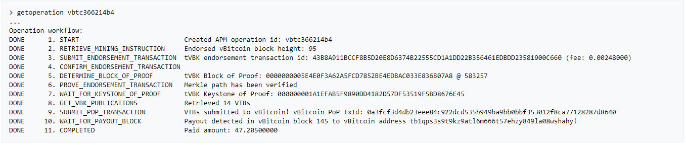
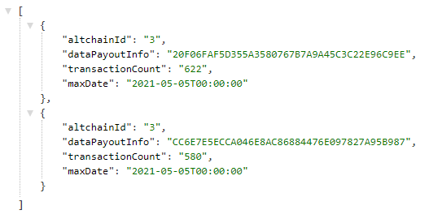
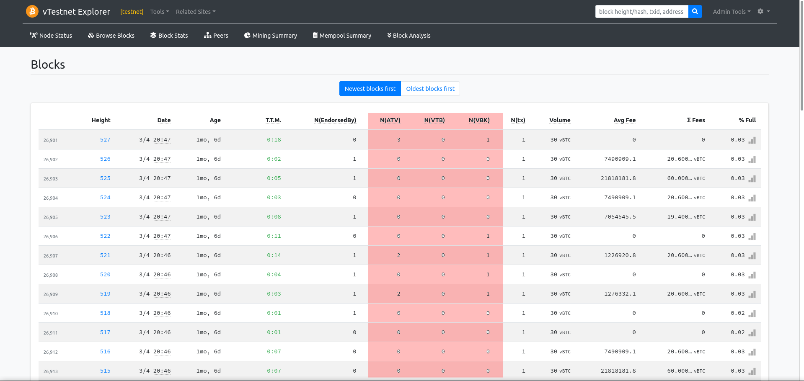
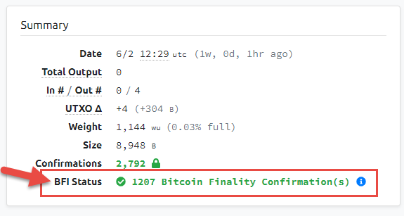
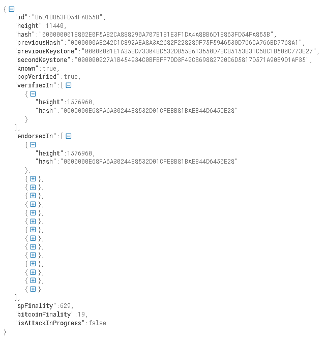

# Testing of POP-enabled BTC fork {#btctesting}
​
[TOC]
​
# Summary
To show that the pop-enabled altchain most likely works, once could screenshots (with supporting links) of:
​
1. All certification tests passing.


2. A single get-opereration from an APM.

​
3. A running network with multiple APM instances. For example, multiple pop tx with different reward addresses on the VBK explorer. If you run this API (with your unique altchain id), then it will return at least 2 rows:
https://testnet.explore.veriblock.org/api/altchain/{altchain id}/validation/apm?withinNHours=4


4. Altchain explorer screenshot showing (1) recent ATV and VTB, and (2) ABFI on a transaction.



5. Run ABFI and view successful health ping
```
http://[ip_to_altchain_abfi]:4568/api/chains/blocks/last-finalized-btc
```
   
   Please see here for more details: [Setup ABFI](integration_13_setup_abfi.md)

​
# Overview
​
Here we describe which POP related tests should be added and should pass to be confident that POP security works fine. All tests can be separated to the following categories:
- `unit tests`
- `BTC functional tests`
- `POP functional tests`
- `View APM get-operation`
​
# Unit tests
​
First thing is to make sure that all original BTC tests pass and work well.
​
On the Unix sytem you can do it with the following command:
```bash
make check
```
​
Before starting the POP integration it is recommended to fix tests if some of them do not work properly.
​
Here is the full list of the POP unit tests:
- `e2e_poptx_tests.cpp`
- `pop_reward_tests.cpp`
- `vbk_merkle_tests.cpp`
- `block_validation_tests.cpp`
- `rpc_service_tests.cpp`
- `genesis_block_tests.cpp`
- `forkresolution_tests.cpp`
​

You can see the corresponding changes in the Makefile: [https://github.com/VeriBlock/vbk-ri-btc/blob/026fba4e80bc114c68c636e3c9cfc6af855c9c94/src/Makefile.test.include#L117](https://github.com/VeriBlock/vbk-ri-btc/blob/026fba4e80bc114c68c636e3c9cfc6af855c9c94/src/Makefile.test.include#L117)
​
These tests are available in the ```vbk/tests/unit``` directory.
​
@note Unit tests should pass prior to running BTC and POP functional tests.
​
# BTC functional tests
​
Original Bitcoin code has functional tests that reside in the ```test/functional``` directory.
​
`bitcoind` should be built prior to running functional tests. ```VBITCOIND_PATH``` environment variable should be set to the path to the `bitcoind` daemon:
```bash
export VBITCOIND_PATH=<path to the daemon (bitcoind)>
```
​
Tests are started with the following command:
```bash
python test/functional/test_runner.py
```
​
# POP functional tests
​
These tests validate that all POP functionality works fine. All important parts of the POP security are covered by these tests. Therefore it is important to make sure that all tests pass before starting Mainnet or even Testnet.
​
VeriBlock Python framework should be installed to make these tests run. Follow the VeriBlock Python testing guide [here](https://github.com/VeriBlock/alt-integration-cpp/blob/master/pypoptools/README.md).
​
Now the following POP test runner can be copied to the source code: [https://github.com/VeriBlock/vbk-ri-btc/blob/master/test/integration/test_runner.py](https://github.com/VeriBlock/vbk-ri-btc/blob/master/test/integration/test_runner.py)
​
A ```node``` which acts as an adaptor for `bitcoind` has been implemented. This adaptor able to ```run```, ```stop```, ```restart``` `bitcoind` and execute RPC functions: [https://github.com/VeriBlock/alt-integration-cpp/blob/master/pypoptools/pypoptesting/altchain_node_adaptors/vbitcoind_node.py](https://github.com/VeriBlock/alt-integration-cpp/blob/master/pypoptools/pypoptesting/altchain_node_adaptors/vbitcoind_node.py)
​
For debugging purposes it is possible to run a single test from the test set:
```bash
python test_runner.py NodeBasicSyncTest
​
```
​
The result of successfully passing tests should look like this:
​
```bash
TEST                  | STATUS    | DURATION

NodeBasicSyncTest     | ✓ Passed  | 90 s
NodeConnectTest       | ✓ Passed  | 28 s
NodeGenerateTest      | ✓ Passed  | 8 s
NodePreflightTest     | ✓ Passed  | 15 s
NodeRestartTest       | ✓ Passed  | 32 s
NodeStartTest         | ✓ Passed  | 18 s
NodeStopTest          | ✓ Passed  | 17 s
PopActivateTest       | ✓ Passed  | 19 s
PopE2ETest            | ✓ Passed  | 41 s
PopForkResolutionTest | ✓ Passed  | 436 s
PopInitTest           | ✓ Passed  | 98 s
PopMempoolGetpopTest  | ✓ Passed  | 326 s
PopMempoolReorgTest   | ✓ Passed  | 38 s
PopMempoolSyncTest    | ✓ Passed  | 64 s
PopParamsTest         | ✓ Passed  | 8 s
PopSyncTest           | ✓ Passed  | 31 s

ALL                   | ✓ Passed  | 1269 s (accumulated)
Runtime: 1273 s
```
​
# View APM get-operation
Run getoperation and view an e2e pop transaction.
@todo add a screenshot

​
# Altchain BFI
The latest [ABFI build](https://hub.docker.com/r/veriblock/altchain-bfi/tags?page=1&ordering=last_updated) can be downloaded through docker
